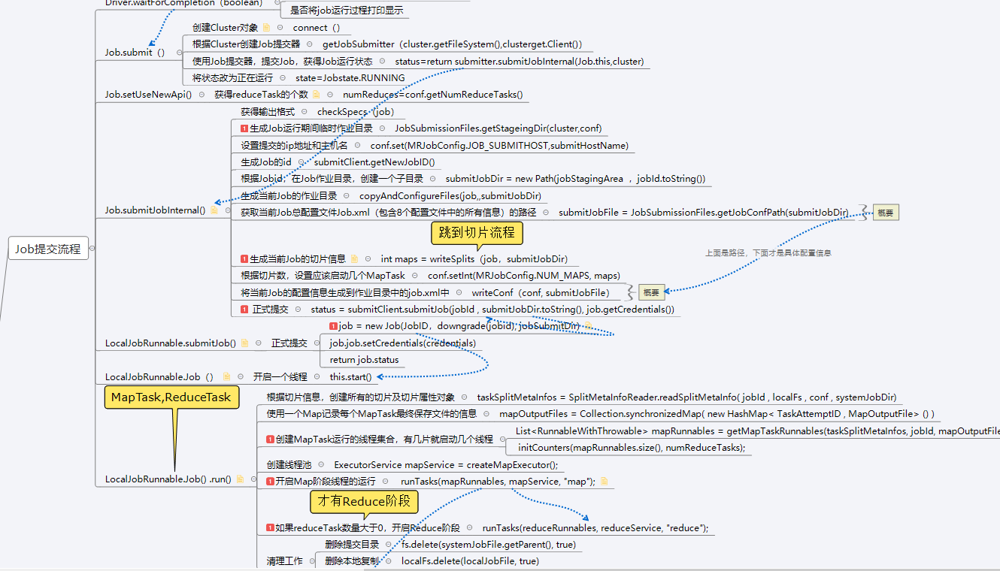

# FocusBigData

## 引子

> 夏季是阳光最为灿烂的季节，走在林间的小道上，看着地上斑驳的树影，闭上双眼感受清风拂面，用力呼吸着每一口自由的气息，也许只有在996福报之外，才能体会得到这种感觉吧，但这或许就是人生吧。

哈哈瞎扯了一堆有的没的，下面开始进入正题，现在随着**5G时代的到来**，信息传输速率大幅提高，对个人来说只不过打开网页快了点，玩游戏延迟低了点，看视频完全不担心卡顿的问题，前提是办理更贵的5G套餐:smile:。但是对于企业来说这个提升，可以带来更高的生产力，带来更高的收益，

> ​	但信息传输速率提高，说明单位时间内获得的数据量比以往更多，说明**单位时间内系统要承担更大的处理压力**，如果没有好的大数据处理框架【框架就是解决方案】，那么信息只能是信息，而不是能带来收益的数据。

现在有很多开发人员都在往大数据领域靠拢，**大数据领域也确实是未来IT方向的一个热点或者说是风口**。在招聘软件上，大数据岗位现在平均薪资约为25K左右，相比开发岗位大约高了百分之40左右，如果是中高阶的大数据架构师甚至可以达到百万薪资。但这诱人的薪资对于同学来说还有距离，但只要我们知道了这个距离具体是指哪些技能，然后**努力去补齐这些技能**，我相信大家也都能达到自己想要的目标。【愿与诸君共勉】

大家如果有什么问题，包括**学习问题，大数据职业规划，简历书写和项目包装**等问题都加我【微信focusbigdata】，或者到【公众号FocusBigData】后台留言给我，看到后都会给大家详细回答的。

​								

## :elephant:Hadoop分布存储框架

+ ### Hadoop篇
  
  + [Hadoop本地模式环境搭建](pdf/hadoop)
  + [Hadoop完全分布式环境搭建](pdf/hadoop)
  + [Hadoop配置历史服务](pdf/hadoop)
  + [Hadoop配置日志聚集](pdf/hadoop)
  + [Hadoop配置集群时间同步](pdf/hadoop)
  + [Hadoop源码编译](pdf/hadoop)
  + [Hadoop集群脚本编写](pdf/hadoop)
  + [Hadoop数据压缩](pdf/hadoop)
  + [Hadoop序列化](pdf/hadoop)
  
+ ### HDFS篇
  
  + [HDFS入门概述](pdf/hadoop)
  + [HDFS命令行操作](pdf/hadoop)
  + [HDFS客户端操作 --- 开发环境准备](pdf/hadoop)
  + [HDFS客户端操作 --- 文件操作](pdf/hadoop)
  + [HDFS客户端操作 --- IO流操作](pdf/hadoop)
  + [HDFS数据读写流程](pdf/hadoop)
  + [NameNode和SecondearyNameNode](pdf/hadoop)
  + [NameNode故障处理](pdf/hadoop)
  + [集群安全模式](pdf/hadoop)
  + [DataNode相关概念](pdf/hadoop)
  + [HA高可用](pdf/hadoop)
  + [HA高可用 --- HDFS-HA集群配置](pdf/hadoop)
  + [HA高可用 --- YARN-HA集群配置](pdf/hadoop)
  + [HA高可用 --- Federation架构设](pdf/hadoop)
  
+ ### MapReduce篇

  + [MapReduce之入门概述](pdf/hadoop)
  + [MapReduce之工作流程](pdf/hadoop)
  + [MapReduce之InputFormat数据输入](pdf/hadoop)
  + [MapReduce之OutputFormat数据输出](pdf/hadoop)
  + [MapReduce之Shuffle机制](pdf/hadoop)
  + [MapReduce之MapJoin和ReduceJoin](pdf/hadoop)
  + [MapReduce之数据清洗ETL](pdf/hadoop)
  + [MapReduce优化](pdf/hadoop)

+ ### Yarn篇

  + [Yarn工作机制和作业提交流程](pdf/hadoop)
  + [Yarn任务推测执行](pdf/hadoop)

+ ### 源码篇

  + Job提交流程
  + MapTask运行
  + ReduceTask运行
  + 切片流程
  + Shuffle流程

【源码是做成思维导图的方式，放在[知识星球](#知识星球)里面，思维导图部分展示如下】

## :dolphin:Spark分布式计算框架

+ ### SparkCore篇

  + [Spark基础入门和环境安装](pdf/spark)
  + [RDD编程入门](pdf/spark)
  + [RDD转换算子](pdf/spark)
  + [RDD行动算子](pdf/spark)
  + [RDD函数传递和依赖关系](pdf/spark)
  + [RDD缓存和checkpoint](pdf/spark)
  + [RDD数据分区](pdf/spark)
  + [RDD数据读取和保存](pdf/spark)
  + [RDD累加器和广播变量](pdf/spark)

+ ### SparkSql篇

  + [SparkSql之DataFrame和DataSet](pdf/spark)
  + [SparkSql之自定义UDF和UDAF函数](pdf/spark)
  + [SparkSql之数据加载和保存](pdf/spark)

+ ### SparkStreaming篇

  + [SparkStreaming之Dstream入门](pdf/spark)
  + [SparkStreaming之Dstream创建](pdf/spark)
  + [SparkStreaming之Dstream转换和输出](pdf/spark)

+ ### Spark内核篇

  + [Spark通信架构和集群启动流程](pdf/spark)
  + [Spark模式运行机制](pdf/spark)
  + [Spark任务调度机制](pdf/spark)
  + [SparkShuffle解析](pdf/spark)
  + [Spark内存管理](pdf/spark)

+ ### Spark调优篇

  + [Spark之常规性能调优](pdf/spark)
  + [Spark之算子调优](pdf/spark)
  + [Spark之Shuffle调优](pdf/spark)
  + [Spark之JVM调优](pdf/spark)
  + [Spark常见故障排查](pdf/spark)
  + [Spark数据倾斜解决方案](pdf/spark)

## :bird:Flink分布式流式框架

+ ### Flink篇

  + [Flink入门](pdf/flink)
  + [Flink部署](pdf/flink)
  + [FlinkAPI之Environment-Source-Transform-Sink](pdf/flink)
  + [Flink运行时架构](pdf/flink)
  + [FlinkAPI之数据类型和UDF函数](pdf/flink)
  + [Flink之Window概述](pdf/flink)
  + [Flink之时间语义和WaterMark](pdf/flink)
  + [Flink之ProcessFunctionAPI](pdf/flink)
  + [Flink之状态编程](pdf/flink)
  + [Flink之容错机制chekpoint](pdf/flink)
  + [Flink之CEP复杂时间处理](pdf/flink)

+ ### FlinkSql篇

  + [FlinkSql之入门概述](pdf/flink)
  + [FlinkSql之Table操作](pdf/flink)
  + [FlinkSql之流式持续查询](pdf/flink)
  + [FlinkSql之窗口](pdf/flink)
  + [FlinkSql之函数](pdf/flink)

> ​	未完待续，最近利用工作之余给给大家先更新了Hadoop、Spark、Flink三个大数据中最主要的框架，后面还陆续给大家跟新如下内容：【[知识星球](#知识星球)每周五晚上发布文章，后面在同步到各个平台】

- Hive数据仓库
- HBase列式存储分布式数据库
- Kafka消息队列
- Sqoop数据传输工具
- Azkaban调度框架
- Kylin分析型数据仓库
- Impala实时查询分析引擎
- Hue大数据web管理器
- Kudu列式存储分布式数据库
- Kettle开源的ETL工具
- DataX阿里开源ETL工具
- ClickHouse开源列式数据库
- Ambari大数据平台搭建利器
- Ranger大数据权限管理利器
- Airflow调度和监控工作流的平台
- Griffin数据质量监控工具
- Tableau大数据分析工具
- Pulsar大数据分析工具
- Atlas元数据治理工具
- Filebeat数据采集工具
- Saiku数据分析工具
- Superset大数据可视化的利器
- Sentry大数据权限管理框架
- Zabbix集群监控工具
- Zepplin数据交互可视化工具

## 数据仓库项目

>【待更新】
>
>- 数据仓库概念
>- 数据仓库建模
>- 数仓分层
>- 数据集市和数据中台和数据仓库区别
>- 数据治理是什么
>- 项目技术选型
>- 系统数据流程设计
>- 服务器选型
>- 集群资源规划
>- 数据埋点设计
>- 数据采集设计
>- 电商业务术语和流程
>- 数据同步策略
>- 漏斗分析
>- 数据监控查询和可视化

## 大数据面试

简历

>可以关注[公众号](#微信公众号)，回复`大数据简历`即可获得简历模板

大数据面试真题

>

大数据面试分享

## 程序人生

## 福利

大数据学习路线图xmind版

大数据书单集合

大数据IDEA

面试资料

简历模板

## 知识星球

知识星球主要提供如下服务：

+ 问题解答
+ 职业规划
+ 思维导图
+ 面试真题
+ 简历包装和背调技巧
+ 模拟面试
+ 学习心得技巧
+  监督打卡模式

>​	创办这个星球的初衷就是为了让更多想了解大数据或者从Web开发转向大数据的同学，通过自学能够快速掌握大数据相关知识并能够上手工作，加入星球的同学记得私聊我，有项目福利

点击或者扫码加入

## 微信公众号

## 关于我

>